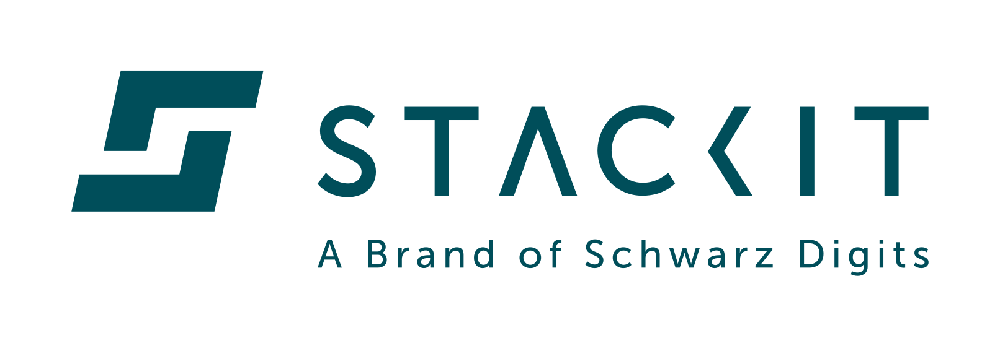

 

 
 

# Landing Zone Accelerator

The STACKIT Landing Zone Accelerator provides a comprehensive Terraform-based framework for deploying secure, scalable, and well-architected cloud environments on STACKIT. Built with enterprise best practices, it enables teams to quickly establish governance, networking, and security foundations.

## 📚 Documentation

- [Getting Started](docs/getting-started.md)

## 🤝 Contributing

Contributions are welcome! Please feel free to submit a Pull Request.

## 📄 License

This project is licensed under the Apache 2.0 License - see the [LICENSE](LICENSE) file for details.